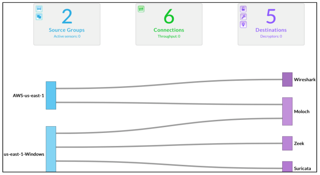
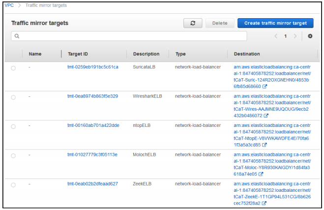

// Add steps as necessary for accessing the software, post-configuration, and testing. Don’t include full usage instructions for your software, but add links to your product documentation for that information.
//Should any sections not be applicable, remove them

== Test the deployment

By default, this Quick Start includes TLS clients that generate standard web traffic as
well as simulated attack instances. To validate the deployment and view the simulated
threats, follow these steps:

. Log in to the Nubeva SaaS console using the credentials you created in Step 2.
. Ensure that you see two instances connected to the console.

[#nubeva_console]
.Checking instances in the Nubeva console
[link=../images/nubeva_test.png]

[start=3]
. Mirror the traffic from the sources to the tools. Amazon VPC mirror targets have
been preconfigured on the open-source tools. Create an Amazon VPC traffic
mirroring session for your clients, and direct them to the pre-configured
destinations.

[#vpc_mirror]
.List of potential traffic mirror targets listed in the AWS Console
[link=../images/vpc_mirror.png]

[start=4]
. Optional: Monitor additional application instances by launching more Nubeva
agents. Choose the Launch a Sensor icon for instructions on how to deploy a new
agent. Ensure that you define a group for the newly launched agents.

. Each tool should be accessed directly:
.. Moloch: Connect to the administration console using the link listed on the
output of the CloudFormation stack, http://elbaddress:8005. The user
name and password are the tooladmin credentials you submitted.
.. Ntopng: Connect to the administrator console using the link listed on the
output of the CloudFormation stack, http://elbaddress:3000. The user
name and password are the default Ntopng credentials.
.. Wireshark: Connect to the wireshark console using the link listed on the 
output of the CloudFormation stack, https://elbaddress:14500. The user name and 
password are the tooladmin credentials you submitted. Monitor the nurx0 interface 
for decrypted cloud traffic.
.. Suricata and Zeek: Connect to the Kibana interface using the link listed on
the output of the CloudFormation stack.

// == Post deployment steps
// // If Post-deployment steps are required, add them here. If not, remove the heading

// == Best practices for using {partner-product-name} on AWS
// // Provide post-deployment best practices for using the technology on AWS, including considerations such as migrating data, backups, ensuring high performance, high availability, etc. Link to software documentation for detailed information.

// _Add any best practices for using the software._

// == Security
// // Provide post-deployment best practices for using the technology on AWS, including considerations such as migrating data, backups, ensuring high performance, high availability, etc. Link to software documentation for detailed information.

// _Add any security-related information._

// == Other useful information
// //Provide any other information of interest to users, especially focusing on areas where AWS or cloud usage differs from on-premises usage.

// _Add any other details that will help the customer use the software on AWS._