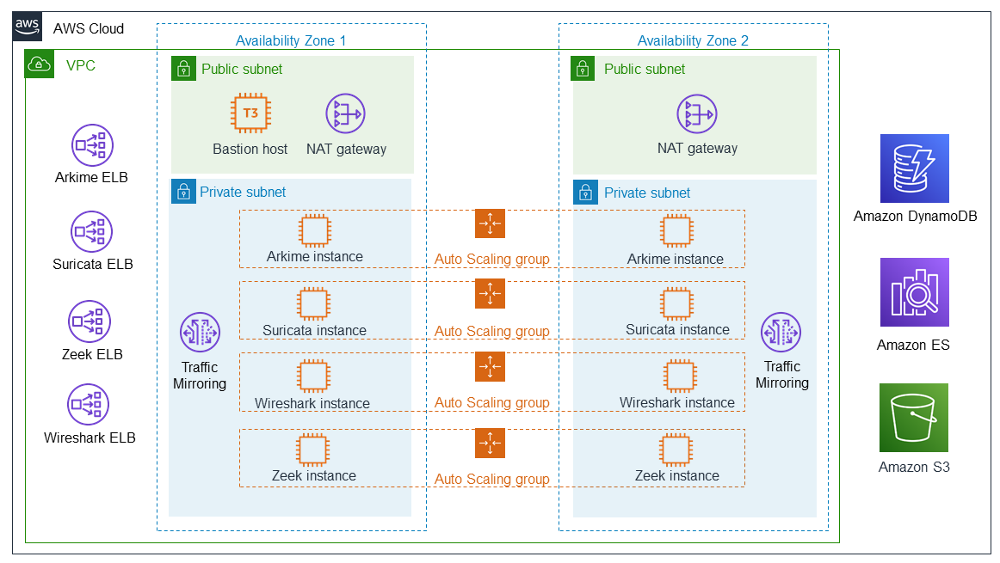

Deploying this Quick Start for a new virtual private cloud VPC with
default parameters builds the following {partner-company-name} SKI network and security monitoring environment in the
AWS Cloud.

// Replace this example diagram with your own. Send us your source PowerPoint file. Be sure to follow our guidelines here : http://(we should include these points on our contributors giude)
[#architecture1]
.Quick Start architecture for Nubeva SKI on AWS
//Sending updated pptx
//old image
//[link=https://d1.awsstatic.com/partner-network/QuickStart/nubeva-tls-decrypt-architecture.51d8abe28801924553866e18a5f255bf3418be63.png]
//image::https://d1.awsstatic.com/partner-network/QuickStart/nubeva-tls-decrypt-architecture.51d8abe28801924553866e18a5f255bf3418be63.png[Architecture,width=648,height=439]
//new image..pptx also included
[link=../images/nubeva-tls-decrypt-architecture-diagram.png]

The Quick Start sets up the following:

* A highly available architecture that spans two Availability Zones.*
* A VPC configured with public and private subnets, according to AWS best practices, to
provide you with your own virtual network on AWS.*
* Elastic Load Balancing (ELB) for each open-source tool to provide scaling for both tool
operation and inbound packet mirroring using Amazon VPC traffic mirrors or
internal replication.
* In the public subnets:
** A bastion host for all inbound connectivity.*
** Managed network address translation (NAT) gateways to allow outbound
internet access for resources in the subnets.*
* In the private subnets:
** A sample source instance in an Auto Scaling group (size 2) used for monitoring TLS traffic. After deployment, use the {partner-company-name} SaaS console to add more instances to monitor. The source instance has a container-based {partner-company-name} SKI agent deployed.
This agent listens through all available interfaces & discovers TLS session keys.
** Arkime packet capture in an Auto Scaling group (size 2).
** Suricata signature detection in an Auto Scaling group (size 2).
** Wireshark packet analysis in an Auto Scaling group (size 2).
** Zeek anomaly detection in an Auto Scaling group (size 2).
* Amazon DynamoDB for key storage.
* Amazon Elasticsearch Service (Amazon ES) for managing the logs from Zeek and Suricata.
* An Amazon Simple Storage Service (Amazon S3) bucket for Arkime packet capture (PCAP) storage.
* Amazon VPC traffic-mirroring targets connected to each open-source load balancer.

*The template that deploys the Quick Start into an existing VPC skips
the components marked by asterisks and prompts you for your existing VPC
configuration.
