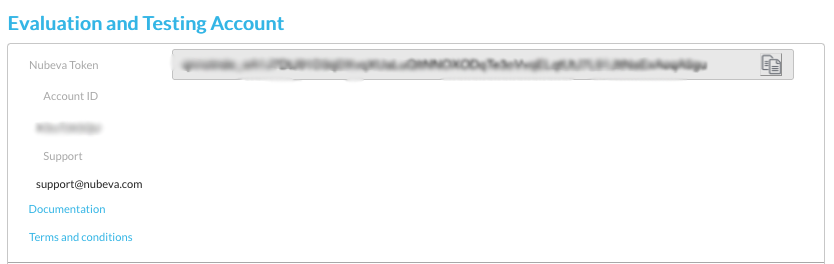

// If no preperation is required, remove all content from here

// ==== Prepare your AWS account

// _Describe any setup required in the AWS account prior to template launch_

==== Prepare your Nubeva account

. Navigate to https://www.nubeva.com, and choose *Login* from the main menu.
. First-time users are prompted to create an account. You can use one of the OAuth
partners to log in.
. Copy in the Nubeva token.

[#nubeva_saas]
.Copy the Nubeva token
[link=../images/nubeva_sass.png]

// ==== Prepare for the deployment

// _Describe any preparation required to complete the product build, such as obtaining licenses or placing files in S3_
